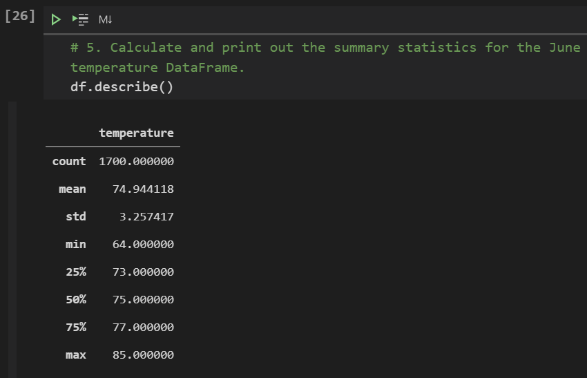
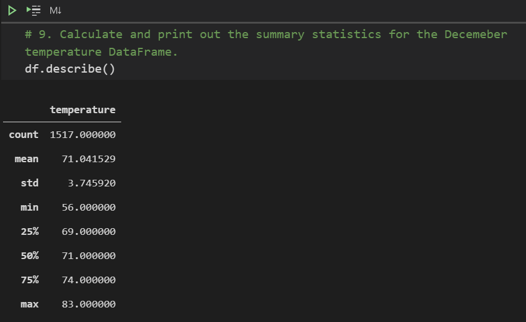
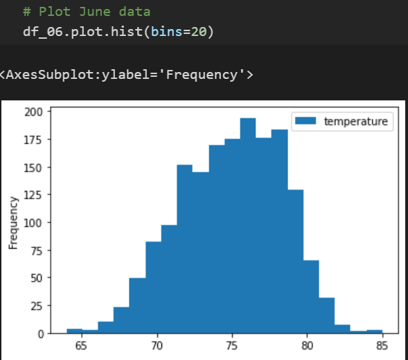
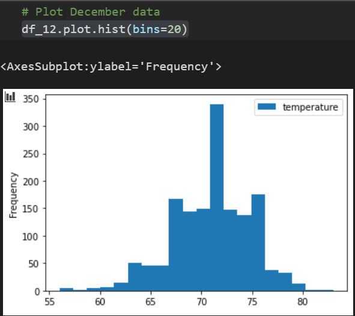
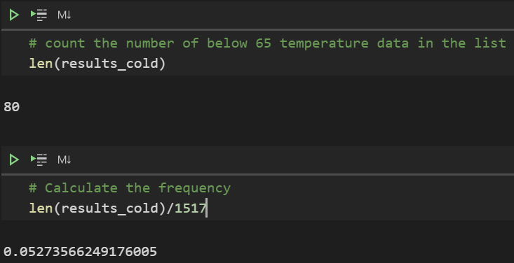

# Surfs Up Analysis
Utilize SQLite and Python to analyze temperature data
## Overview of the Project
Using SQLite data and Python to determine whether opening a surf and ice cream shop business in Oahu would be sustainable year-round. In order to determine that business decision, we will find summary statistics of temperature data by outputting the following technical analysis and a written report:

Deliverable 1: Determine the Summary Statistics for June
Deliverable 2: Determine the Summary Statistics for December
Deliverable 3: A written report for the statistical analysis

## Resources
- Data Source: hawaii.sqlite
- Used code: SurfsUp_Challenge.ipynb
- Software: Visaul Studio Code, Jupytor Note Book
- Internet resource: <https://surfing-waves.com/equipment/wetsuit-temperature-guide.htm>

## Results
  Based on the two technical analysis summarizing the temperature of June and December in Oahu, we can find followings differences in weather between June and December.
  
*** Summary Statistics of June Temperature in Oahu ***
  
   
   
*** Summary Statistics of December Temperature in Oahu ***
  
   

   
  1. Comparing the two summary statistics above, we can find that the temperature of December is in average 3.9 degrees in fahrenheit lower compared to the temperature of June. Given the mean temperature of both June and December in Oahu is above 71 degrees, it seems that Oahu is suitable for surfing and ice cream business year-round if we only focus on this information.
  2. The max temperature of both June and December are ranged between 83 and 85 degrees. This is not exceedingly hot for surfing activity.
  3. On the other hand, the minimum temperature in December is 56 degrees. This would be too cold for both surfing and ice cream business, and thus we should make additional gathering of data to measure how often the cold weather occurs in December.
  
## Summary
   In addition to above observations, we delivered a few additional queries to gather more weather information for June and December. 
   In order to determine "What temperature would be **too** cold for surfing," I researched a little on the web to draw the line. Based on the research, I conclude that below 65 degrees would be uncomfortable for surfing, and thus surfing business would be unprofittable:

  1. First of all, we run queries to visualize how temperature data is spread in June and December.
  
   First of all, we create two DataFrames for June temperature and December temperature.
  *** Query for June Temperature DataFrame *** 
  ```
  june = "06"
  results_june = []
  results_june = session.query(Measurement.date, Measurement.tobs).\
      filter(func.strftime("%m",Measurement.date) == june).all()
  df_06 = pd.DataFrame(results_june, columns = ['date','temperature'])
 ```
 *** Query for December Temperature DataFrame *** 
 ```
  dec = "12"
  results_dec = []
  results_dec = session.query(Measurement.date, Measurement.tobs).\
      filter(func.strftime("%m",Measurement.date) == dec).all()
  df_12 = pd.DataFrame(results_june, columns = ['date','temperature'])
```
   Then, run below queries to plot temperature data in histogram.
```
  df_06.plot.hist(bins=20)
  and 
  df_12.plot.hist(bins=20)
```
  
   
   
   
   Based on the provided visualization, we can see that both June and December temprature data are normaly distributed around their mean value. In addition, we can learn from the December Summary Statistics that 75% of its data are distributed between 69 degrees to 83 degrees. Therefore, if we consider that above 65 degrees is warm enough for comfortable surfing, we can expect that 75% of days in December be warm enough. 
   
  2. Lastly, let us further reseach how often Oahu will experience the weather below 65 degrees by running an additional query below:
  ```
  # filter December data with temperature below 64
  results_cold = []
  results_cold = session.query(Measurement.date, Measurement.tobs).\
      filter(func.strftime("%m",Measurement.date) == dec).\
      filter(Measurement.tobs <= 64.9).all()
  results_cold
  
  # count the number of below 65 temperature data in the list
  len(results_cold)
  
  # Calculate the frequency
  len(results_cold)/1517
  ```
  
   
   
   Based on the queries, we learn that there are **80days** that Oahu recorded temperature below 65 degrees in December among its **1517 days** of data. Thus, only **5.27%** of days in December (about 1-2 days in a month) will likely be below 65 degrees.
   
   In summary, based on the anlaysis, we can expect that June is suitable for surf and ice cream business for everyday. In addition, the business is expected to be suitable for the weather for more than 94% of time during December as the temperature is above 65 degrees. Therefore, the surf and ice cream business is good for Oahu weather for year-round.

    
  
